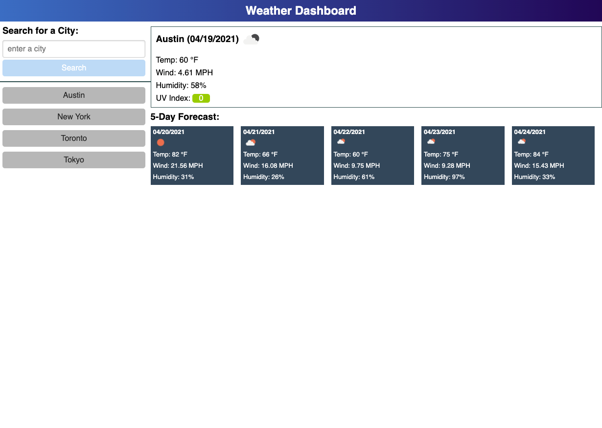

# **Bryan Godwin - Week 6 Challenge**

## **Server-Side API Challenge: Weather Dashboard**

### This challenge is to build a weather dashboard that will run in the browser and feature dynamically updated HTML and CSS.

### **User Story**

    AS A traveler
    I WANT to see the weather outlook for multiple cities
    SO THAT I can plan a trip accordingly

### **Acceptance Critera**

1.  User can search for a city

        WHEN I search for a city
        THEN I am presented with current and future conditions for that city and that city is added to the search history

2.  User can see detailed weather results for a search

        WHEN I view current weather conditions for that city
        THEN I am presented with the city name, the date, an icon representation of weather conditions, the temperature, the humidity, the wind speed, and the UV index

3.  UV results are detailed

        WHEN I view the UV index
        THEN I am presented with a color that indicates whether the conditions are favorable, moderate, or severe

4.  User is presented with detailed 5-day forecast for a search

        WHEN I view future weather conditions for that city
        THEN I am presented with a 5-day forecast that displays the date, an icon representation of weather conditions, the temperature, the wind speed, and the humidity

5.  User can quickly view results of prior searches

        WHEN I click on a city in the search history
        THEN I am again presented with current and future conditions for that city

### **Challenge Six - code repository**

<https://github.com/godwinbw/weather-dashboard>

### **Challenge Six - live link**

<https://godwinbw.github.io/weather-dashboard/develop/>

### **Challenge Six - screenshot**

